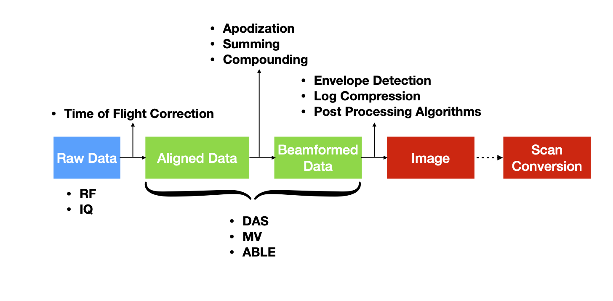

# Ultrasound-BMd
Ultrasound-BMd (usbmd) is a collection of ultrasound tools (Python) such as beamforming code, visualization tools and deep learning scripts.
The idea of this toolbox is that it is self-sustained, meaning ultrasound researchers can use the tools to create new models / algorithms and after completed, can add them to the toolbox.

In case of any questions, feel free to [contact](mailto:t.s.w.stevens@tue.nl).

## Table of contents
* [Setup](#setup)
* [Data](#data)
* [How to contribute](#how-to-contribute)

## Setup
### usbmd installation
This package can be installed like any open-source python package from PyPI.
Make sure you are in the root folder (`Ultrasound-BMd`) where the [`setup.py`](setup.py) file is located and run the following command from terminal:
```bash
python -m pip install -e .
```
The -e option stands for editable, which is important because it allows you to change the source code of the package without reinstalling it. You can leave it out, but changing the code in the repository won't change the installation (which is OK if you do not need to change it).

You can use the package as follows:
```Python
# Local imports
from usbmd import tensorflow_ultrasound as usmbd_tf
```

### Conda environment
Install anaconda from [here](https://www.anaconda.com/products/individual#windows).

To reproduce the environment on your own machine perform:
```bash
conda env create -f conda/tf26_usbmd.yaml
```

### Getting started
In order to get started, you can run [`ui.py`](usbmd/ui.py), which runs the "user interface"
tool for inspecting datasets. First, it will ask for a config file for which you can choose one of your own configs or one of the defaults in the [`configs`](configs) folder.
Second, you can navigate to the appropriate datafile (make sure it is in the dataset you specified in the config). Depending on the settings, it will render and show the image.

## Data

### Data paths
In order to use this repository and point to the correct data paths, you can enter the location of your dataroot in the [`common.py`](usbmd/common.py) file. It is possible to add multiple devices / platforms per user by means of if statements.
The default location is `Z:\Ultrasound-BMd\data` which is the path to the data on the NAS.

### Datastructure
This repository can support custom datastructures by implementing your own [Dataset](./usbmd/datasets.py) class, but the preferred way makes use of the `.hdf5` file format and is structured as follows:
```c
data_file.hdf5                  // [unit], [array shape]
├── data
│    │  (see data types)
│    └── `dtype`                // [-], [n_frames, n_angles, n_ax, n_elem]
│       (... optional ...)
│        ├── real               // [-], [n_frames, n_angles, n_ax, n_elem]
│        └── imag               // [-], [n_frames, n_angles, n_ax, n_elem]
│
│  (all other settings go here)
├── angles                      // [m], [n_angles]
├── initial_time                // [s]
├── modulation_frequency        // [Hz]
├── probe_geometry              // [m], [n_elem, 3]
├── sampling_frequency          // [Hz]
├── sound_speed                 // [m/s]
├── PRF                         // [Hz]
└── ... (other optional parameters)
```

### Data Flow Diagram

<p align="left">

</p>

### Data types
The following terminology is used in the code when referring to different data types.
- `raw_data` --> The raw channel data, storing the time-samples from each distinct ultrasound transducer.
- `aligned_data` --> Time-of-flight (TOF) corrected data. This is the data that is time aligned with respect to the array geometry.
- `beamformed_data` --> Beamformed or also known as beamsummed data. Aligned data is coherently summed together along the elements. The data has now been transformed from the aperture domain to the spatial domain.
- `envelope_data` --> The envelope of the signal is here detected and the center frequency is removed from the signal.
- `image` --> After log compression of the envelope data, the image is formed.
- `image_sc` --> The scan converted image is transformed cartesian (`x, y`) format to account for possible curved arrays. Possibly interpolation is performed to obtain the preferred pixel resolution.

## How to contribute
Please see [`CONTRIBUTING.md`](docs/CONTRIBUTING.md) on guidelines to contribute to this repository.
Make sure your code complies with the style formatting of this repo. To do that, check if pylint runs succesfully (10/10) by running the following in the root directory
```bash
pylint usbmd
```
Currently this is only required for the develop / main branch.