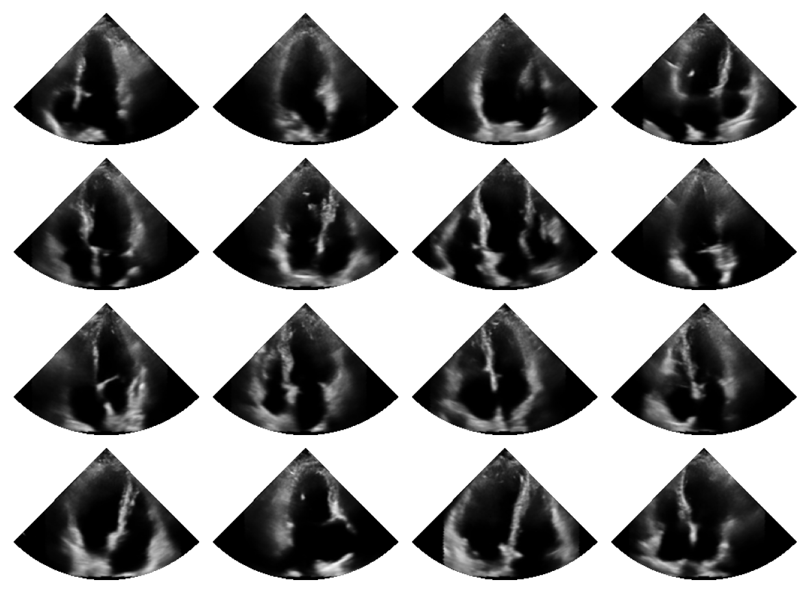

# Summary
Ultrasound imaging is a powerful medical imaging modality that is widely used in clinical settings for various applications, including obstetrics, cardiology, and abdominal imaging. While ultrasound imaging is non-invasive, real-time, and relatively low-cost compared to other imaging modalities such as MRI or CT, it still faces challenges in terms of image quality, and interpretation. Many signal processing steps are required to extract useful information from the raw ultrasound data, such as filtering, beamforming, and image reconstruction. Traditional ultrasound imaging techniques often suffer from reduced image quality as naive assumptions are made in these processing steps which do not account for the complex nature of ultrasound signals. Furthermore, acquisition (action) and reconstruction (perception) of ultrasound is often performed disjointly. Cognitive ultrasound imaging [@van2024active] is a novel approach that aims to address these challenges by leveraging more powerful generative models, enabled by advances in deep learning, to close the action-perception loop. This approach requires a redesign of current common ultrasound imaging pipeline, where parameters are expected to be changed dynamically based on past and current observations. Furthermore, the high-dimensional nature of ultrasound data requires powerful deep generative models to learn the structured distribution of ultrasound signals. This necessitates a flexible and efficient toolbox that can handle the complexities of cognitive ultrasound imaging, including a real-time ultrasound reconstruction pipeline, dynamic parameter adjustment, and advanced generative modeling.

We present `zea` (pronounced *za-yah*), a Python package for cognitive ultrasound imaging that provides a flexible and modular pipeline for ultrasound data processing, as well as a collection of pre-defined models for ultrasound image and signal processing. The toolbox is designed to be easy to use, with a high-level interface that allows users to define their own ultrasound reconstruction pipelines, and to integrate deep learning models into the pipeline. The toolbox is built on top of Keras [@chollet2015keras], which provides a framework for building and training deep learning models with the three major deep learning frameworks as backend: TensorFlow [@abadi2016tensorflow], PyTorch [@NEURIPS2019_9015] and JAX [@jax2018github]. This means that it is easy to integrate a custom ultrasound reconstruction pipeline in a machine learning workflow. In the past few years, several works have used and contributed to `zea`, including @van2024off, @stevens2024dehazing, @nolan2024active, @stevens2025sequential and @stevens2025high.

# Statement of need

Some of the existing ultrasound toolboxes, such as `k-wave` [@treeby2010k] and `Field II` [@jensen1992field], `ARRUS` [@jarosik2020arrus], `FAST` [@smistad2021fast]


# Overview
`zea` contains a few core components that are essential for building a cognitive ultrasound imaging system. These components include:

- **Data**: `zea` works with HDF5 files, to easily load and save ultrasound data.
  It also provides a set of utility classes such as `zea.data.File`, `zea.data.Dataset` and `zea.data.Dataloader`, to handle data for machine learning workflows.
- **Pipeline**: A flexible and modular pipeline class that allows users to define a sequence of operations to process ultrasound data.
  The pipeline is stateless and supports JIT compilation for maximum performance. Ultimately this allows for dynamic parameter adjustment, as well as real-time use of deep learning models inside the reconstruction pipeline.
- **Models**: A collection of pre-defined models for ultrasound image and signal processing.
  These models can be loaded locally or from Hugging Face [@wolf2020huggingface].
- **Agents**: A set of agents that can be used to interact with the pipeline and models.
  These agents can be used to alter the pipeline parameters, or selected subset of acquired data.

## Data
TBA

## Pipeline
More TBA

At the heart of `zea` is a flexible pipeline class that allows users to define a sequence of operations to process ultrasound data. The pipeline is designed to be modular, enabling users to easily add, remove, or modify operations as needed. This flexibility is crucial for adapting the pipeline to different ultrasound imaging scenarios. One of the key features of the pipeline is that it is stateless, meaning that, by default, it does not store any state information between operations.

```python
from zea.ops import *

pipeline = zea.Pipeline(
    operations = [
        Demodulate(),
        PatchedGrid(
            operations = [
                TOFCorrection(),
                PfieldWeighting(),
                DelayAndSum()
            ],
            num_patches = 100
        ),
        EnvelopeDetect(),
        Normalize(),
        LogCompress(),
    ],
    with_batch_dim = False,
    jit_options = "pipeline",
)

outputs = pipeline(**inputs, **parameters, dynamic_range=(-50, 0))

image = outputs[pipeline.output_key]
```

## Models
More TBA

```python
pipeline = zea.Pipeline([zea.ops.ScanConvert(order=1, jit_compile=False)])

parameters = {
    "theta_range": [-0.78, 0.78],  # [-45, 45] in radians
    "rho_range": [0, 1],
}
prior_samples = keras.ops.squeeze(prior_samples, axis=-1)

parameters = pipeline.prepare_parameters(**parameters)
processed_batch = pipeline(data=prior_samples, **parameters)["data"]

## Plotting
set_mpl_style()
fig, _ = zea.visualize.plot_image_grid(
    processed_batch, vmin=-1, vmax=1,
)
```

Which will generate the following output:

{ width=90% }

## Agent
TBA


# References
