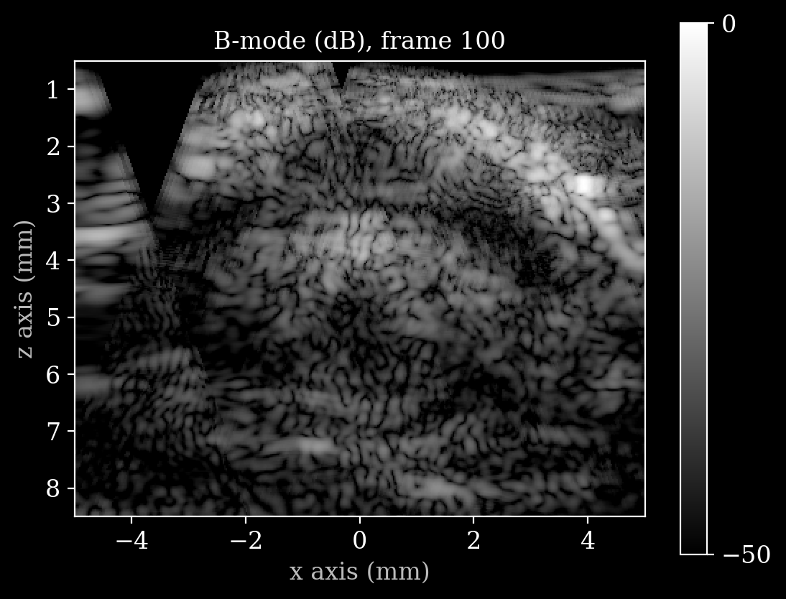
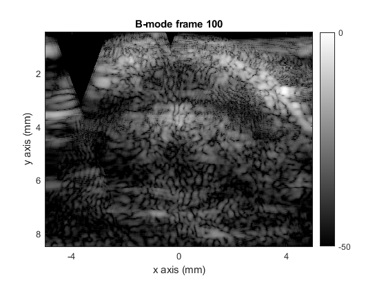
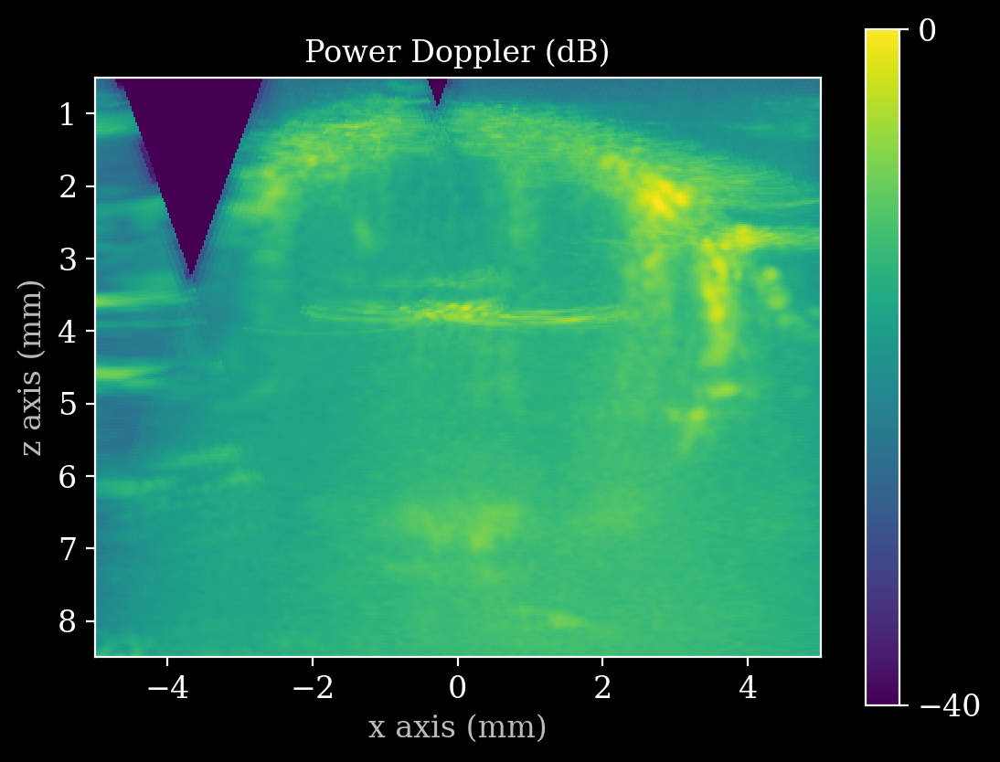
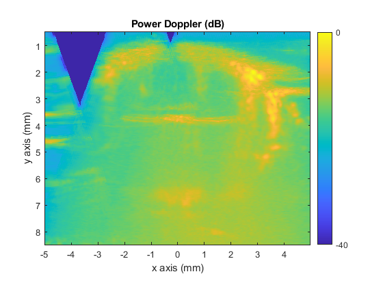
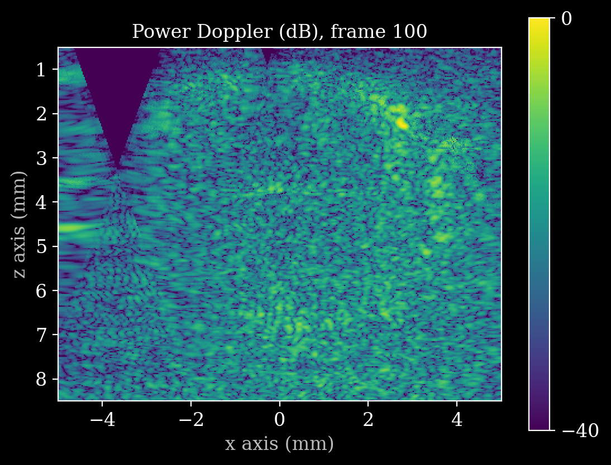
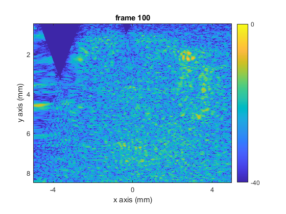

# ULMShare: zea vs. MATLAB

A Python port of the ULMShare processing pipeline (up to Power-Doppler) using
[zea](https://github.com/tue-bmd/zea) for beamforming, compared against the
original MATLAB/MUST pipeline.

- **zea:** [`process.py`](process.py) — delay-and-sum via zea (JAX backend), IQ
  compounding, SVD clutter filter, Power-Doppler.
- **MATLAB:** [`matlab/example_script_one_buffer_bmode.m`](matlab/example_script_one_buffer_bmode.m)
  — MUST `das` beamforming + the same downstream steps (plus TAL ULM tracking,
  which is *not* ported).

Both were run on `mouse_1 / acquisition_1`, buffer/data #100 (400-frame movie,
11 plane-wave angles, L22-14v probe).

## Output comparison

The zea outputs live in [`zea_output/`](zea_output/); the MATLAB outputs are
copied into [`matlab_output/`](matlab_output/) for reference.

### B-mode (frame 100)

| zea ([`zea_output/bmode.png`](zea_output/bmode.png)) | MATLAB ([`matlab_output/bmode.png`](matlab_output/bmode.png)) |
|:---:|:---:|
|  |  |

Envelope structure, speckle pattern, and the triangular f-number aperture
shadow at the top-left match closely. Same `[-50, 0]` dB range, gray colormap.

### Power Doppler (frame-integrated)

| zea ([`zea_output/power_doppler.png`](zea_output/power_doppler.png)) | MATLAB ([`matlab_output/power_doppler.png`](matlab_output/power_doppler.png)) |
|:---:|:---:|
|  |  |

Integrated vascular map agrees on the main vessel structures (the bright
right-side bundle around x≈3 mm, the horizontal band near z≈3.8 mm, and the
diffuse perfusion). Same `[-40, 0]` dB range and parula/viridis-style colormap.

### Power Doppler (single frame 100)

| zea ([`zea_output/power_doppler_movie.png`](zea_output/power_doppler_movie.png)) | MATLAB ([`matlab_output/power_doppler_movie.png`](matlab_output/power_doppler_movie.png)) |
|:---:|:---:|
|  |  |

A single clutter-filtered frame — noisier than the integrated map, but the same
blood-signal speckle statistics and vessel hotspots appear in both.

> **Note:** the MATLAB `power_doppler_movie.png` is a single captured frame of
> the live `powerDopplerMovie` loop; the zea file of the same name is the
> single-frame Power-Doppler snapshot (`--frame 100`). Both show frame 100.

## Algorithmic differences

Both pipelines follow the same high-level recipe — **DAS beamform each angle →
compound → SVD clutter filter → Power-Doppler** — with the same processing
parameters (`fnumber = 1.4`, `[-0.5, 0.5] cm × [0.05, 0.85] cm` grid at 25 µm,
5% clutter cutoff). The differences are in *how* each stage is computed:

| Stage | MATLAB (`example_script_one_buffer_bmode.m`) | Python (`process.py`) |
|---|---|---|
| **Beamformer** | MUST `das` — loops over angles, calls `das` per angle on a `meshgrid` of pixels. | zea `Beamform(beamformer="delay_and_sum")`, JAX-jitted, patched (`num_patches=100`). |
| **Delay model** | `txdelay(Probe, angle)` transmit delays; MUST computes `tau = (dTX+dRX)/c` internally, rectangular f-number aperture. | `compute_t0_delays_planewave` + zea DAS; `initial_times=0`, `t_peak=0` chosen to match MUST's timing exactly (no pulse-peak offset). |
| **Compounding** | Beamform all angles into a 4-D array, then `sum(iq_bf, 4)`. | Beamform pipeline sums over transmits internally, per frame. |
| **Clutter filter (SVD)** | `svd(iq_cf' * iq_cf)` — MATLAB `'` is a **conjugate** transpose, so the Gram matrix is Hermitian and correct for complex IQ. Drops the first `Ncut-1` eigenvectors. | Re-implemented with an explicit `conj(casorati.T) @ casorati`. Note: zea's built-in `suppress_tissue` uses a *plain* transpose (for real input) and is **not** used here, because it would not suppress tissue on complex IQ. |
| **Envelope / B-mode** | `20*log10(abs(iq_bf))` per frame (the analytic IQ is already the envelope). | Same; `bmode()` optionally frame-averages, but the shown frame-100 image is per-frame to match. |
| **Iteration** | `for k_angle` beamform loop + `waitbar`; live `imagesc` movie loops for display. | `for k` frame loop, JAX-jitted pipeline; saves PNGs via matplotlib. |
| **ULM stage** | **Included:** TAL toolbox does localization + tracking → density map. | **Not ported** — stops at Power-Doppler (no Python TAL equivalent). |

### Subtle points worth calling out

- **IQ sampling frequency.** Both derive `fs` from the demodulation mode
  (`BS100BW → fs = fc`, `BS50BW → fs = fc/2`), *not* from the
  `startDepth`/`endDepth` fields. `process.py` documents this explicitly because
  deriving `fs` from the depth window over-compresses the axial scale.
- **Angle ordering.** The plane-wave angles are in Verasonics *ping-pong* order
  (`-5, 5, -4, 4, …, 0`), not monotonic. Both pipelines must pair each transmit
  with its own angle in that order; `process.py` preserves it in
  `raw_to_iq` / `load_sequence_json`.
- **Data layout.** MATLAB reads column-major (`order="F"`), which `process.py`
  reproduces when un-interleaving I/Q and reshaping the event axis
  (`angle varies fastest, then frame`).
- **The conjugate-transpose gotcha** (above) is the single most consequential
  numerical difference to get right — a plain transpose silently produces a
  wrong Gram matrix and fails to remove tissue clutter.

The close visual agreement above indicates the timing, aperture, and
clutter-filter choices in the port reproduce the MUST pipeline faithfully.
