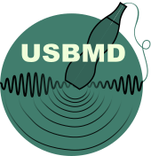
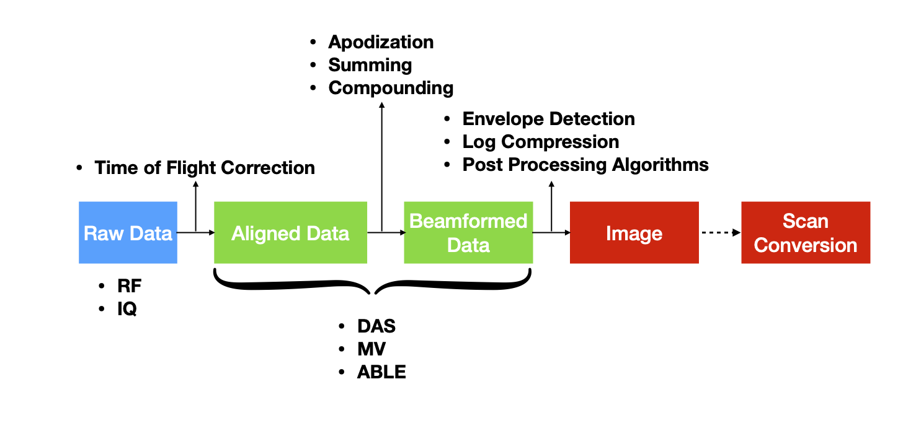

<!-- This is the readme for the pdoc documentation (used as header in index.html) -->
# usbmd 

The ultrasound toolbox (usbmd) is a collection of ultrasound tools (Python) such as beamforming code, visualization tools and deep learning scripts. Check out the full documentation [here](http://131.155.125.142:6001/) (only available within the TU/e network).

The idea of this toolbox is that it is self-sustained, meaning ultrasound researchers can use the tools to create new models / algorithms and after completed, can add them to the toolbox. This repository is being maintained by researchers from the [BM/d lab](https://www.tue.nl/en/research/research-groups/signal-processing-systems/biomedical-diagnostics-lab/) at Eindhoven University of Technology. Currently for [internal](LICENSE) use only.

In case of any questions, feel free to [contact](mailto:t.s.w.stevens@tue.nl).

Currently usbmd offers:

- Complete ultrasound signal processing and image reconstruction pipeline.
- A collection of models for ultrasound image and signal processing.
- Multi-Backend Support via [Keras3](https://keras.io/keras_3/): You can use [PyTorch](https://github.com/pytorch/pytorch), [TensorFlow](https://github.com/tensorflow/tensorflow), or [JAX](https://github.com/google/jax)


## Installation

Install options can be found in the [Install.md](Install.md) file.

## Example usage
After installation, you can use the package as follows in your own project. `usbmd` is written in Python on top of [Keras 3](https://keras.io/about/). This means that under the hood we use the Keras framework to implement the pipeline and models. Keras allows you to set a backend ("jax", "tensorflow", "torch" or "numpy"), which means you can use `usbmd` alongside all your projects that are implemented in their respective frameworks. To get started you first have to specify your preferred backend. This can be done by setting the `KERAS_BACKEND` environment variable, either in your code or in your terminal. The default backend used by `usbmd` is "numpy", if no backend is specified before importing `usbmd`. This will not allow you to use the GPU for processing.


```shell
# set the backend in your terminal
export KERAS_BACKEND="jax"
```

```python
# or set the backend in your code at the top of your script
import os
os.environ["KERAS_BACKEND"] = "jax"
```

After setting the backend you can simply import `usbmd`
```python
import usbmd
```

> **Note:** You should make sure to install the requirements for your chosen backend as these are not included by default in a plain usbmd install. For example, if you choose "jax" as your backend, make sure to install the necessary JAX libraries. The provided docker image (see [Install.md](Install.md)) has all the necessary libraries pre-installed. Alternatively, you can install the necessary libraries by running `pip install usbmd[jax]` although this is not extensively tested (yet).

More complete examples can be found in the [examples](examples) folder.

## Installation

For install options see the [Install.md](Install.md).

## Getting started

#### Importing

After installation, you can use the package as follows in your own project:

```python
# import usbmd package
import usbmd
# or if you want to use the Tensorflow tools
import usbmd.backend.tensorflow as usbmd_tf
# or if you want to use the Pytorch tools
import usbmd.backend.torch as usbmd_torch
```

#### User interface

In order to get started with usbmd stand-alone, you can simply run [`usbmd`](__main__.html), which is the main entry point of the toolbox runs the "user interface" tool for inspecting datasets. First, it will ask for a config file for which you can choose one of your own configs or one of the defaults in the [`configs`](../../configs) folder. Second, you can navigate to the appropriate datafile (make sure it is in the dataset you specified in the config). Depending on the settings, it will render and show the image. There are already some example configs:

```shell
usbmd --config configs/config_picmus.yaml
```

If you make your own config, make sure it can be validated using the [config validation](utils/config_validation.html) schema. This ensures it has the correct structure and all required parameters are present.

#### GPU support

Make sure that before using any GPU enabled functionality (importing torch / tensorflow) the following code is run:

```python
# import the init_device function
from usbmd.utils.device import init_device
import keras

# initialize device manually
device = init_device("auto:1", "torch", hide_devices=None)

# or using your config
device = init_device(config.device, hide_devices=config.hide_devices)
```

Alternatively, you can use the `setup` function using a config file, which will initialize the device and setup the data paths:

```python
# import the setup function
from usbmd.setup_usbmd import setup
config = setup("configs/config_picmus_rf.yaml")
```

## Data

### Data paths

In order to use this repository and point to the correct data paths, you'll need to create a user profile. We have a script to guide you through the setup and create your userprofile; start by running `python usbmd/datapaths.py` (see [`datapaths.py`](datapaths.html)). When you run this script, you will be prompted to provide a path to your data directory -- the default location is `Z:\Ultrasound-BMd\data` which is the path to the data on the NAS. Your user profile will then be created at `users.yaml`. Once it's created, you can edit your profile to add multiple devices or data paths -- see the example below.

```yaml
MY_USER_NAME:
  MY_DEVICE_NAME:
    system: windows
    data_root:
      local: D:\Datasets
      remote: Z:\Ultrasound-BMd\data
```

#### Datastructure

This repository can support custom datastructures by implementing your own [Dataset](datasets.html) class, but the preferred way makes use of the `.hdf5` file format. For more information on dataset format, see [usbmd/data_format/README.md](data_format/index.html). The datasets are structured as follows:

```c
data_file.hdf5                  // [unit], [array shape], [type]
├── data
│    │  (see data types)
│    └── `dtype`                // [-], [n_frames, n_tx, n_el, n_ax, n_ch], [float32]
│
│  (all settings go here)
├── scan
│    │── center_frequency       // [Hz], [-], [float32]
│    │── sampling_frequency     // [Hz], [-], [float32]
│    │── n_tx                   // [-], [-], [int16]
│    │── n_el                   // [-], [-], [int16]
│    │── n_ax                   // [-], [-], [int16]
│    │── angles                 // [rad], [n_tx, 2], [float32]
│    │── virtual_sources        // [m], [n_tx, 3], [float32]
│    │── transmit_apodization   // [-], [n_tx, n_el], [float32]
│    │── tzero                  // [-], [n_tx, n_el], [float32]
│    │── probe_geometry         // [m], [n_el, 3], [float32]
│    │── sound_speed            // [m/s], [-], [float32]
│    │── initial_times          // [s], [-], [float32]
│    └── ... (other optional parameters)
```

#### Data Flow Diagram



#### Data types

The following terminology is used in the code when referring to different data types.

* `raw_data` --> The raw channel data, storing the time-samples from each distinct ultrasound transducer.
  - [n_frames, n_tx, n_el, n_ax, n_ch]
* `aligned_data` --> Time-of-flight (TOF) corrected data. This is the data that is time aligned with respect to the array geometry.
  - [n_frames, n_tx, n_el, n_ax, n_ch]
* `beamformed_data` --> Beamformed or also known as beamsummed data. Aligned data is coherently summed together along the elements. The data has now been transformed from the aperture domain to the spatial domain.
  - [n_frames, n_z, n_x]
* `envelope_data` --> The envelope of the signal is here detected and the center frequency is removed from the signal.
  - [n_frames, n_z, n_x]
* `image` --> After log compression of the envelope data, the image is formed.
  - [n_frames, n_z, n_x]
* `image_sc` --> The scan converted image is transformed cartesian (`x, y`) format to account for possible curved arrays. Possibly interpolation is performed to obtain the preferred pixel resolution.
  - [n_frames, output_size_z, output_size_x]

## How to use with Verasonics

Record plane wave data using the Verasonics system, for instance using your favorite flash angles example script. Then save the data using the save RF button which saves the matlab workspace to disk along with all acquisition parameters needed for reconstruction. You can use [`matlab.py`](data/convert/matlab.html) to convert those workspace files to usbmd format. One way to quickly read those generated `.hdf5` files is though running [`usbmd`](__main__.html) in your terminal. Adapt one of the configs in template configs folder and point to your dataset. Then when running [`usbmd`](__main__.html) you can select that config and start visualizing your newly generated datafile.


## How to contribute

Please see [`CONTRIBUTING.md`](../CONTRIBUTING.md) on guidelines to contribute to this repository.
Make sure your code complies with the style formatting of this repo. To do that, check if pylint runs succesfully (10/10) by running the following in the root directory:

```shell
pip install -e .[dev] # in case dev dependencies were not installed
pylint usbmd
```

Also make sure all the pytest tests are running succesfully (100%) by running the following command in the root directory:

```shell
pip install -e .[dev] # in case dev dependencies were not installed
pytest ./tests
```

Currently this is only required for the develop / main branch.
